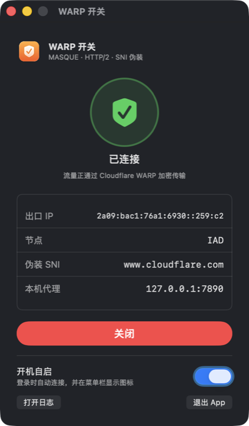

# warp-masque-bypass

> 在封锁了 Cloudflare WARP 的学校/公司网络中，通过 MASQUE over HTTP/2 协议绕过防火墙，全程走标准 HTTPS 流量，不易被识别。

## 使用场景

Cloudflare WARP 的默认传输协议是 WireGuard（UDP）。校园网/企业网常见的封锁手段有两种：

- **封 WireGuard UDP**：直接丢掉所有 WireGuard 握手包，换 IP 和端口都没用。
- **按 SNI 封 MASQUE**：WARP 的新一代协议 MASQUE 走 TCP 443，但握手时会明文带上域名 `consumer-masque.cloudflareclient.com`，防火墙一看到就切断连接。

本项目的做法是：用开源工具 [usque](https://github.com/Diniboy1123/usque) 连接 WARP，传输层改为 **HTTP/2 over TCP 443**，并把握手的 SNI 换成一个普通域名（默认 `www.cloudflare.com`）。在防火墙看来，这只是一次访问 Cloudflare 网站的普通 HTTPS 请求。[sing-box](https://github.com/SagerNet/sing-box) 负责将隧道暴露为本机系统代理（HTTP/SOCKS5，端口 7890），并自动设为 macOS 系统代理，浏览器和大多数 App 无需额外配置。

### 适用条件

- macOS（Apple Silicon 或 Intel）
- 安装了 [Homebrew](https://brew.sh)
- TCP 443 出口畅通（学校没有完全断外网）
- 学校封的是 WireGuard 或 WARP 的 MASQUE 默认 SNI，而非所有 Cloudflare IP

如果不确定，先运行 `diagnostics/diagnose.sh` 自动诊断。

---

## 图形界面

安装完成后，从启动台或 Spotlight 搜索「WARP 开关」打开桌面 App：



- **主窗口**：显示连接状态、出口 IP、节点、伪装 SNI，一键开启/关闭
- **开机自启**：登录时自动连接，菜单栏常驻图标
- **菜单栏图标**：关掉窗口后图标保留，点击可快速开关或重新打开窗口
- **退出 App**：只关闭界面，不断开连接

> 第一次打开时如果 macOS 提示"无法验证开发者"，在 Finder 中右键选"打开"即可（本地自签名，未经 Apple 公证）。

---

## 快速开始

```bash
git clone https://github.com/EdmundMad0309/warp-masque-bypass.git
cd warp-masque-bypass
./install.sh
```

安装完成后，终端会打印类似以下内容表示成功：

```
ip=<WARP 出口 IP>
colo=IAD
warp=on
✅ 已连接 WARP
```

之后**每次登录自动启动**，无需再手动操作。

---

## 安装说明

```
install.sh
```

一键脚本，按顺序完成以下操作：

1. 用 Homebrew 安装 **sing-box**（若未安装）
2. 从 GitHub Release 下载 **usque** 二进制，并用官方 `checksums.txt` 做 SHA256 校验
3. 注册一个新的 Cloudflare WARP 账号（账号凭证保存在 `usque/config.json`，不会提交到 Git）
4. 生成两个 launchd 服务文件（`~/Library/LaunchAgents/`），登录时自动启动，崩溃时自动重启
5. 启动服务并验证 `warp=on`

可重复运行：已安装的部分会跳过，修改 `config.env` 后重新运行即可生效。

---

## 日常使用

| 操作 | 命令 |
|------|------|
| 启动（开机后手动启动） | `./start.sh` |
| 停止并清除系统代理 | `./stop.sh` |
| 完全卸载（删除 launchd 服务） | `./uninstall.sh` |
| 查看实时日志 | `tail -f usque.log` 或 `tail -f singbox.log` |

服务启动后，**系统代理自动设为 `127.0.0.1:7890`**，Safari、Chrome、VS Code 等遵守系统代理的应用无需额外设置。

### 终端走代理

终端命令默认不走系统代理，需要手动指定：

```bash
export https_proxy=http://127.0.0.1:7890
export http_proxy=http://127.0.0.1:7890
# 验证
curl -s https://www.cloudflare.com/cdn-cgi/trace | grep warp
```

如需长期生效，加到 `~/.zshrc` 里。

---

## 配置

编辑根目录的 `config.env`，修改后重新运行 `./install.sh` 生效：

```bash
# 伪装用的 SNI（TLS 握手中明文可见的域名）
# 学校封了哪个就换哪个，用 diagnostics/test-sni.sh 测试
SNI=www.cloudflare.com

# usque 本地 SOCKS5 端口（sing-box 会把流量转发到这里）
USQUE_PORT=1080
```

已验证可用的 SNI（在测试环境中均能连通 WARP）：

- `www.cloudflare.com`（默认）
- `cloudflareaccess.com`
- `www.bing.com`

---

## 诊断工具

### 自动诊断网络封锁类型

```bash
diagnostics/diagnose.sh
```

输出示例：
```
== 1. 普通 HTTPS(TCP 443)
cloudflare.com -> 200
== 2. UDP 53 (DNS)
UDP 53 通
== 3. QUIC / HTTP3 (UDP 443)
QUIC 到 cloudflare.com -> v3
== 4. 到 WARP 入口的 TCP 443
162.159.198.2:443 TCP 通
162.159.192.1:443 TCP 不通
== 5. SNI 测试(对 WARP 入口做 TLS 握手)
SNI=consumer-masque.cloudflareclient.com 握手失败/被重置  <-- 按 SNI 封锁
SNI=www.cloudflare.com 握手成功
```

### 测试指定 SNI 能否连通

```bash
diagnostics/test-sni.sh www.example.com h2
# h2 = HTTP/2 over TCP；h3 = HTTP/3 over QUIC（UDP 443）
```

---

## 工作原理

```
浏览器/App
    │ HTTP/SOCKS5
    ▼
sing-box :7890  ──→  系统代理，内网流量直连
    │ SOCKS5
    ▼
usque :1080
    │ MASQUE over HTTP/2 (TCP 443)
    │ SNI = www.cloudflare.com（伪装）
    │ 公钥固定校验（不依赖 SNI，安全不受影响）
    ▼
Cloudflare WARP 服务器
    │
    ▼
      互联网
```

**为什么改 SNI 不影响安全性**：usque 使用固定的公钥（certificate pinning）来验证服务器身份，TLS 握手中的 SNI 只是用来让防火墙"看到"一个普通域名，不参与实际的服务器认证。

**为什么不用 HTTP/3（QUIC）**：QUIC 走 UDP 443，在测试环境中 WARP 服务器对应的 UDP 端口同样不通，因此只用 HTTP/2。

---

## 安全与隐私注意事项

- `usque/config.json` 包含你的 WARP 账号私钥，已加入 `.gitignore`，**不会被提交到 Git**，请妥善保管，不要手动分享。
- 本工具注册的是免费 WARP 账号，流量经过 Cloudflare，遵守 [Cloudflare 服务条款](https://www.cloudflare.com/terms/)。
- **绕过学校网络限制可能违反校规或当地法律法规，请自行评估风险。**

---

## 参考与致谢

| 工具 | 用途 | 许可证 |
|------|------|--------|
| [usque](https://github.com/Diniboy1123/usque) | MASQUE 协议客户端，连接 Cloudflare WARP | MIT |
| [sing-box](https://github.com/SagerNet/sing-box) | 通用代理平台，暴露系统代理 | GPL-3.0 |
| [wgcf](https://github.com/ViRb3/wgcf) | 用于初期 WireGuard 测试（最终方案未使用） | MIT |

---

## License

MIT © 2026 jiahaowang
